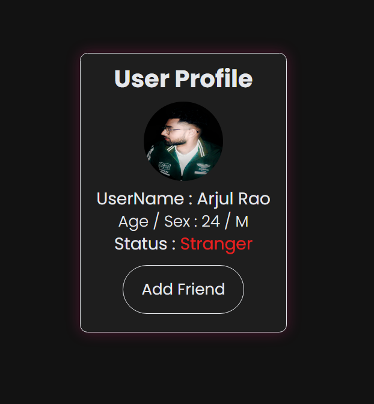
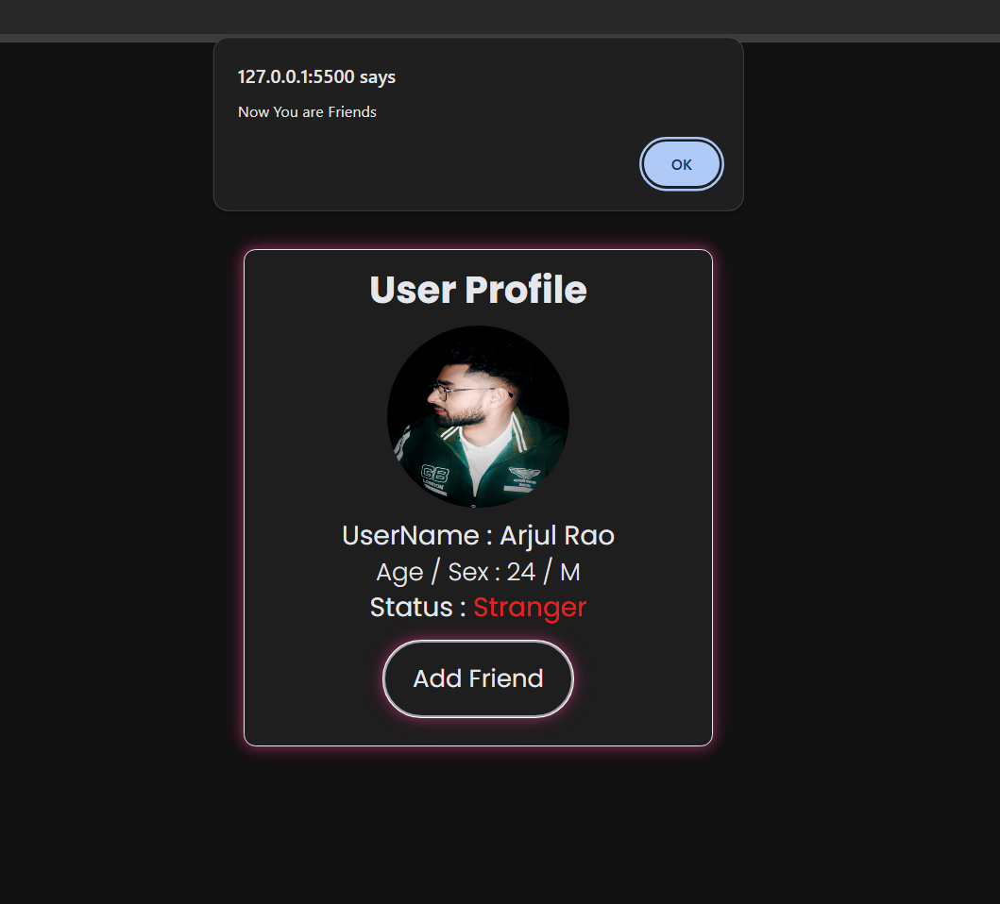
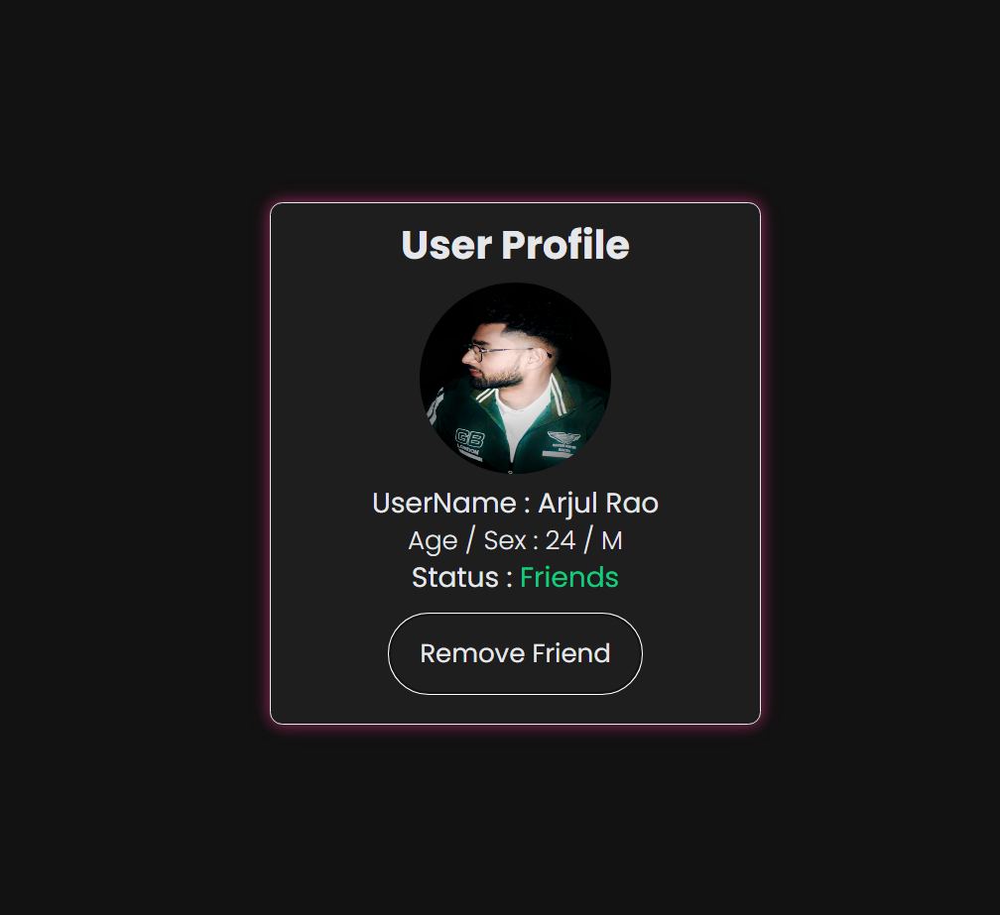
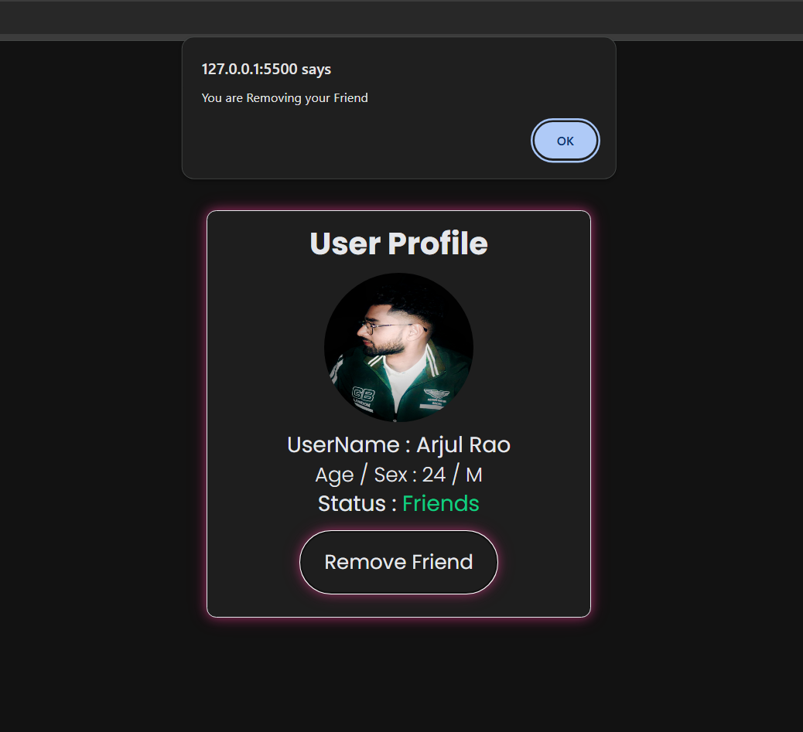

# Interactive User Profile Card

A simple and elegant **User Profile Card** with an interactive **"Add Friend"** button, built with HTML, CSS, and JavaScript.

## 🔥 Features
- 🌑 **Dark Mode Design** with a sleek UI
- 🎭 **Dynamic Status Update:** Click the button to switch between "Stranger" and "Friends"
- ✨ **Hover Effects & Animations**
- ⚡ **Minimal & Responsive Layout**

## 📌 Technologies Used
- HTML5
- CSS3 (Custom Styling)
- JavaScript (DOM Manipulation)

## 🎥 Preview
## 🎨 UI Preview
### Default View

### Hover Effect

### Friend Added State

### Removed Friend State

## 📬 Connect With Me
- 🔗 [LinkedIn](www.linkedin.com/in/rao-arjul)
- 📸 [Instagram](https://www.instagram.com/arjul.dev)
- 💻 [GitHub](https://github.com/arjulrao)
# add_friend_card
